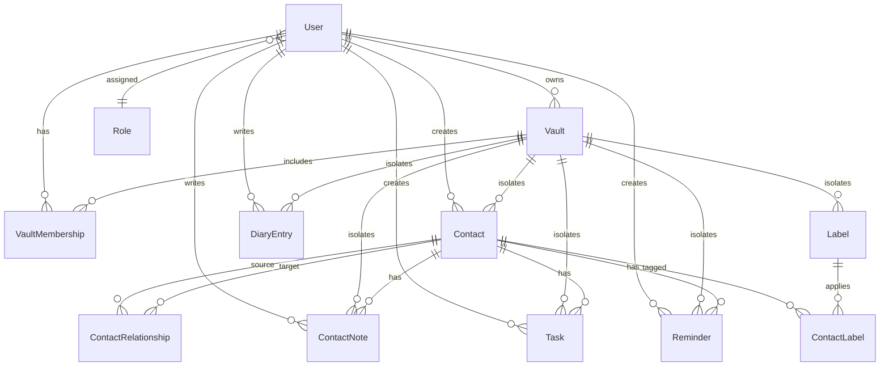

# Domain Models & Relationship Memory

## 1. Relational Entity Architecture

---

## 2. Entity Descriptions & Scopes

### Vault & VaultMembership
- **`Vault`**: The fundamental tenant boundary. Has `name`, `description`, `ownerUserId`.
- **`VaultMembership`**: Maps `(vaultId, userId)` with `role` (`owner` | `admin` | `member` | `viewer`).

### Contact Management
- **`Contact`**: Belongs to `vaultId` and `ownerId`. Contains `firstName`, `lastName`, `email`, `phone`, `jobTitle`, `companyId`, `gender`, `isDeceased`, `birthdate`, `notes`.
- **`ContactRelationship`**: Directional or mutual link between `contactId` and `relatedContactId` with `relationshipType` (*Spouse, Child, Parent, Colleague, Manager, Friend, Acquaintance, Introducer*).
- **`ContactNote`**: Rich text or markdown note on a contact. Has `contactId`, `vaultId`, `authorUserId`, `isPinned`, `body`.

### Productivity & Planning
- **`Task`**: Associated with `vaultId` and optional `contactId`. Has `title`, `description`, `dueDate`, `completedAt`, `priority` (1-4), `assigneeUserId`.
- **`Reminder`**: Recurring or one-shot notification linked to `contactId` or `vaultId`. Has `title`, `scheduledFor`, `frequency` (*once, daily, weekly, monthly, yearly*), `isCompleted`.
- **`DiaryEntry`**: Journal log for a specific calendar date (`entryDate`). Has `vaultId`, `authorUserId`, `title`, `body`, `sentimentScore`.

### Taxonomy & Categorization
- **`Label`**: Custom tags scoped per `vaultId` with `name` and `color` (hex).
- **`ContactLabel`**: Join table mapping `(contactId, labelId)`.
- **`Attachment`**: Uploaded file reference with `fileName`, `fileUrl`, `fileSize`, `mimeType`, `vaultId`, `contactId`.

### Legacy Sales CRM Entities
- **`Company`**, **`Deal`**, **`Activity`**: Supported for commercial contact workflows.
